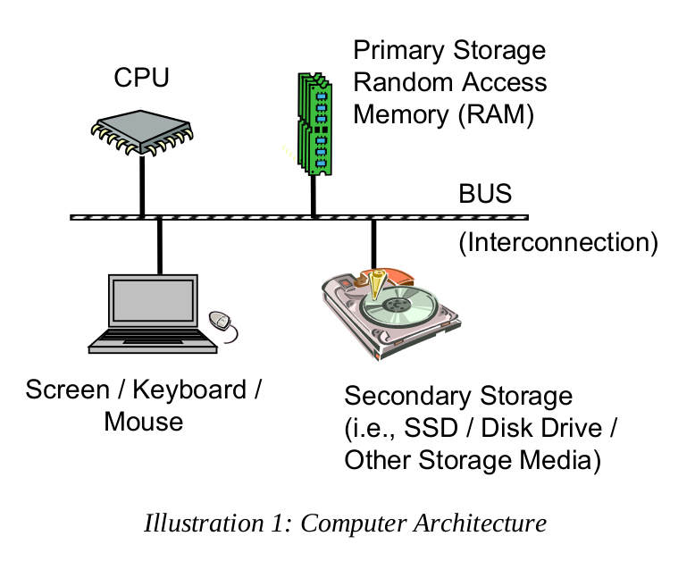

## $\textnormal{Architecture Overview}$

> - The basic components of computer include a `Central Processing Unit (CPU)`,  
    `Primary Storage` or `Random Access Memory (RAM)`, `Secondary Storage`,  
    `Input/Output devices` (screen, keyboard, mouse, etc.), and an interconnection  
    referred to as the `Bus`.

| Illustration 1: Computer Architecture |
| ------------------------------------- |
|  |
