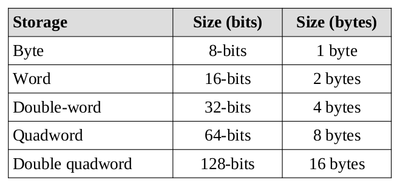

## $\textnormal{Data Storage Sizes}$

> - The `x86-64` architecture supports a specific set of data storage  
    size elements, all based on power of two.

> - The supported storage sizes are as follows.

 

| Supported Storage Sizes |
| ----------------------- |
|  |

 
