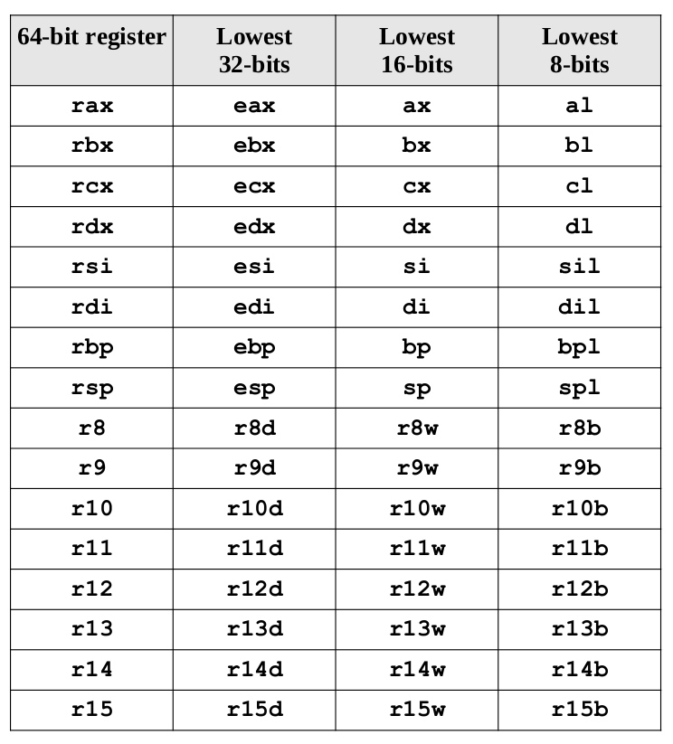

## $\textnormal{General Purpose Registers (GPRs)}$

> - There are sixteen, 64-bit GPRs.

> - A `GPR` register can be accessed with all 64-bits or some  
    portion or subset accessed.

 

| General Purpose Registers (GPRs) |
| -------------------------------- |
|  |

 

> - When using data element sizes less than `64-bits` (i.e., 32-bit, 16-bit, or 8-bit),  
    the lower portion of the register can be accessed by using a different register  
    name/

> - When accessing the lower portion of the 64-bit `rax` register.
